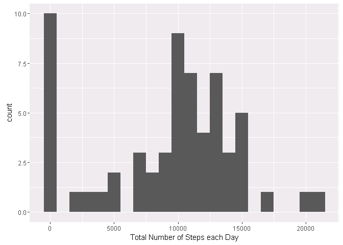
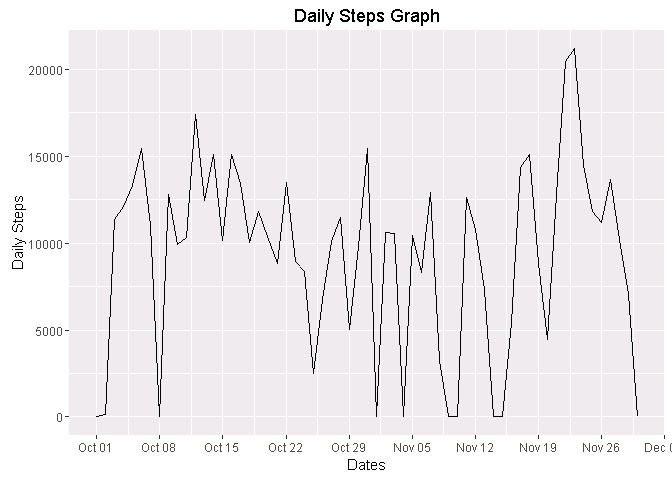
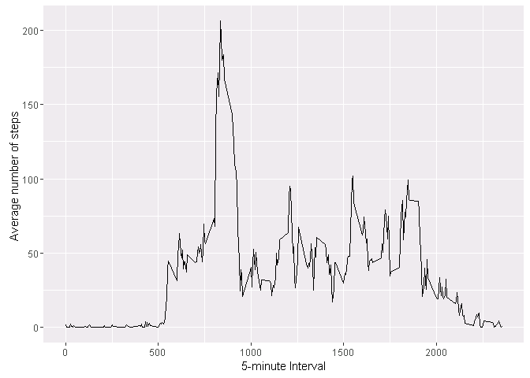
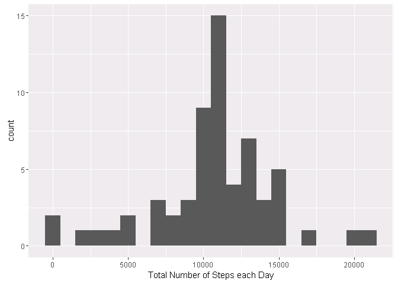
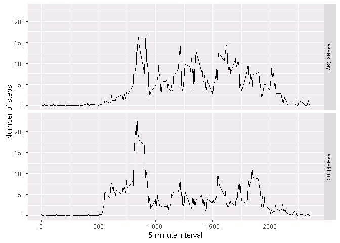

# Reproducible Research using R Markdown
Chandu Rangari  
4 September 2016  


# Activity Analysis Peer Assignment 1

## 1. Load and Process Data


```r
activity <- read.csv("../data/activity.csv",header = TRUE,sep = ",")
```

## 2.What is mean total number of steps taken per day?
- Calculate the total number of steps taken per day.
- Make a histogram of the total number of steps taken each day.
- Calculate and report the mean and median of the total number of steps taken per day


```r
StepsPerDay <- tapply(activity$steps,activity$date,FUN = sum,na.rm=TRUE)
qplot(StepsPerDay,xlab="Total Number of Steps each Day",binwidth=1000)
```

<!-- -->

```r
StepsPerDayplot<-as.data.frame(StepsPerDay)
StepsPerDayplot$date <-rownames(StepsPerDayplot)
StepsPerDayplot$date<-as.Date(StepsPerDayplot$date)

ggplot(StepsPerDayplot, aes(date, StepsPerDay)) + geom_line() +
     xlab("Dates") + ylab("Daily Steps")+
    scale_x_date(date_breaks = "1 week", date_labels = "%b %d") +
    ggtitle("Daily Steps Graph")
```

<!-- -->

```r
perDayMean <-mean(StepsPerDay,na.rm=TRUE)
perDayMedian <-median(StepsPerDay,na.rm = TRUE)
perDayMean
```

```
## [1] 9354.23
```

```r
perDayMedian
```

```
## [1] 10395
```

## 3. What is the average daily activity pattern?

- Make a time series plot (i.e. type = "l") of the 5-minute interval (x-axis) and the average number of steps taken, averaged across all days (y-axis) Which 5-minute interval, on average across all the days in the dataset, contains the maximum number of steps?


```r
avgDailyPattern <- aggregate(x=list(steps=activity$steps),by=list(interval=activity$interval),FUN=mean,na.rm=TRUE)
ggplot(data=avgDailyPattern,aes(x=interval,y=steps)) +
    geom_line()+
    xlab("5-minute Interval") +
    ylab("Average number of steps ")
```

<!-- -->

```r
MaxStepsDays <- avgDailyPattern[which.max(avgDailyPattern$steps),]
MaxStepsDays
```

```
##     interval    steps
## 104      835 206.1698
```

## 4. Imputing missing values

- Calculate and report the total number of missing values in the dataset (i.e. the total number of rows with NAs)
- Devise a strategy for filling in all of the missing values in the dataset. 
- Create a new dataset that is equal to the original dataset but with the missing data filled in.


```r
TotalNa <- is.na(activity)
table(TotalNa)
```

```
## TotalNa
## FALSE  TRUE 
## 50400  2304
```

```r
# Fill up missing data
FillNA <- function(steps,interval)
{
    FillValue<-NA
    if(!is.na(steps))
        FillValue <-c(steps)
    else
        FillValue <- avgDailyPattern[avgDailyPattern$interval==interval,"steps"]
    
    return(FillValue)
    
}

FillnaActivity <- activity

FillnaActivity$steps <- mapply(FillNA,FillnaActivity$steps,FillnaActivity$interval)
```
- Make a histogram of the total number of steps taken each day and Calculate and report the mean and median total number of steps taken per day. 

```r
StepsPerDay1 <- tapply(FillnaActivity$steps,FillnaActivity$date,FUN = sum)

perDayMean <-mean(StepsPerDay1,na.rm=TRUE)
perDayMedian <-median(StepsPerDay1,na.rm = TRUE)
perDayMean
```

```
## [1] 10766.19
```

```r
perDayMedian
```

```
## [1] 10766.19
```

```r
qplot(StepsPerDay1,xlab="Total Number of Steps each Day",binwidth=1000)
```

<!-- -->

```r
StepsPerDayplot<-as.data.frame(StepsPerDay1)
StepsPerDayplot$date <-rownames(StepsPerDayplot)
StepsPerDayplot$date<-as.Date(StepsPerDayplot$date)

ggplot(StepsPerDayplot, aes(date, StepsPerDay)) + geom_line() +
     xlab("Dates") + ylab("Daily Steps")+
    scale_x_date(date_breaks = "1 week", date_labels = "%b %d") +
    ggtitle("Daily Steps Graph")
```

<!-- -->

## 5. Are there differences in activity patterns between weekdays and weekends?

- Create a new factor variable in the dataset with two levels - "weekday" and "weekend" indicating whether a given date is a weekday or weekend day.
- Make a panel plot containing a time series plot (i.e. type = "l") of the 5-minute interval (x-axis) and the average number of steps taken, averaged across all weekday days or weekend days (y-axis).


```r
FillnaActivity$TypeofDay <-ifelse(as.POSIXlt(FillnaActivity$date)$wday %in% c(0,6),"WeekDay","WeekEnd")

aggregateDay<-aggregate(steps~interval+TypeofDay,data=FillnaActivity,FUN = mean)

ggplot(aggregateDay, aes(interval, steps)) + geom_line() + facet_grid(TypeofDay ~ .) +
    xlab("5-minute interval") + ylab("Number of steps")
```

<!-- -->
